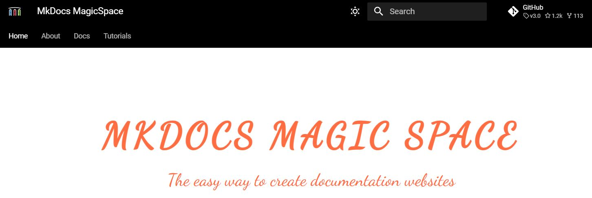

# Links

-------------------------------------

## DocOps

+ Как разработать техническую документацию, которая точно будет работать. Часть 2. DocOps в действии 
<https://habr.com/ru/companies/swordfish_security/articles/754780/>  
Local article [DocOps Part-2](../00_articles/DocOps Part-2.htm).

## MarkDown

+ Язык разметки Markdown: шпаргалка по синтаксису с примерами  
<https://skillbox.ru/media/code/yazyk-razmetki-markdown-shpargalka-po-sintaksisu-s-primerami/#stk-19>  
Local article [Markdown_SkillboxMedia-1](../00_articles/Markdown_SkillboxMedia-1.htm).

## MkDocs Material

+ **Material for MkDocs**   
*Official site*
<https://squidfunk.github.io/mkdocs-material/>  
??? info
    { width="800" }

+ **MKDOCS MAGIC SPACE**  
*The easy way to create documentation websites*     
<https://mkdocs-magicspace.alnoda.org/>  
??? info
    { width="800" }

    

+ **PyMdown Extensions Documentation**
https://facelessuser.github.io/pymdown-extensions/

+ **MkDocs Material Extensions**  
<https://pypi.org/project/mkdocs-material-extensions/>
Local article [MkDocs Material Extensions](../00_articles/mkdocs-material-extensions_PyPI.html).

+ **MkDocs TOC**    
<https://pypi.org/project/mkdocs-toc-md/>

+ **Reproducible Reports with MkDocs**    
<https://timvink.nl/reproducible-reports-with-mkdocs/>

